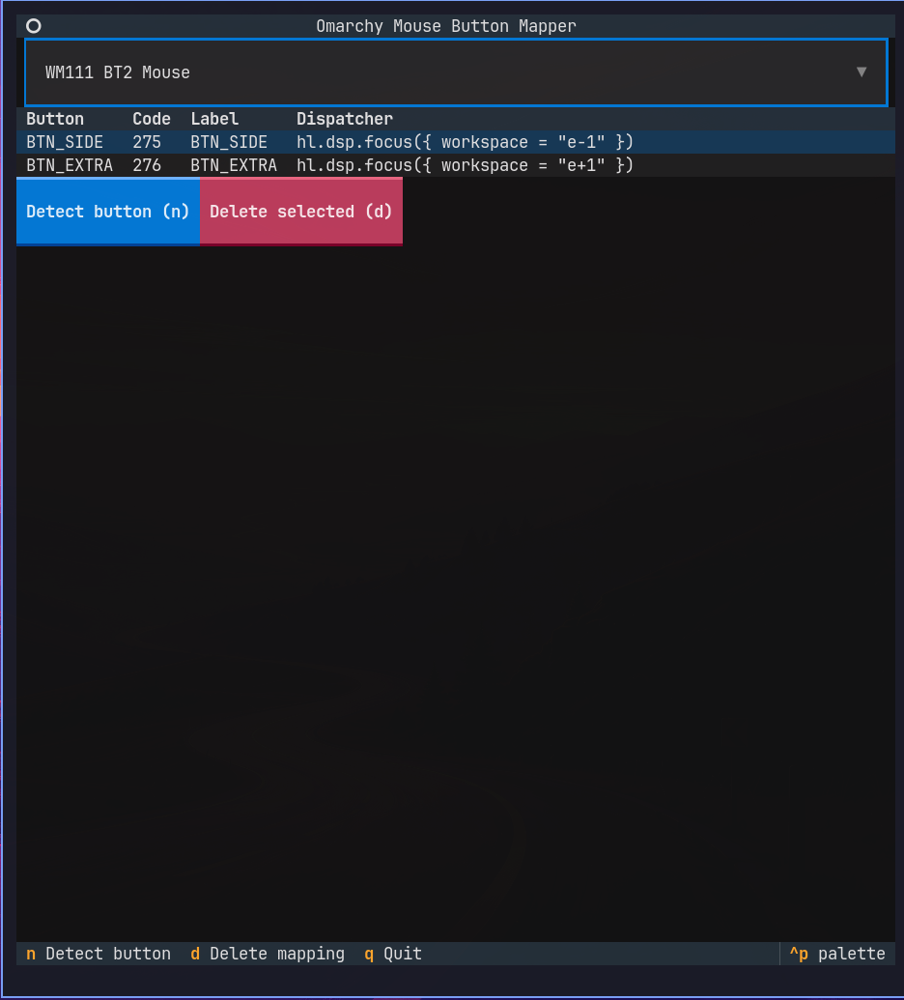

# Omarchy Side Mouse Button Mapper

A small TUI for mapping mouse side buttons (back/forward, thumb buttons) to
[Omarchy](https://omarchy.org)/Hyprland actions — workspace switching,
window management, launching apps, and more. Pick your mouse, press the
side button to identify it, name it, choose a Hyprland/Omarchy action (or a
custom shell command), and it writes a real
`o.bind("mouse:<code>", ...)` binding into `~/.config/hypr/bindings.lua` and
reloads Hyprland.

No background daemon — once written, Hyprland owns the binding natively,
same as any other keybind.



## Install

### Arch / Omarchy: prebuilt package (recommended)

Every [release](https://github.com/GSkrt/omarchy-side-mouse-button-mapper/releases)
has a ready-to-install `pacman` package attached — `python-textual`/
`python-evdev` are declared as real package dependencies, so `pacman`
resolves them for you, no build step, no AUR account needed:

Releases are signed. `pacman`'s default `SigLevel` requires a signature it
can verify, so import the release-signing key once and mark it trusted
before your first install (subsequent releases from the same key just
work):

```bash
curl -sL https://raw.githubusercontent.com/GSkrt/omarchy-side-mouse-button-mapper/main/packaging/keys/release-signing-key.asc | sudo pacman-key --add -
sudo pacman-key --lsign-key 8453C618302E97E4
```

Then install:

```bash
sudo pacman -U https://github.com/GSkrt/omarchy-side-mouse-button-mapper/releases/download/v0.1.0/omarchy-side-mouse-button-mapper-0.1.0-2-any.pkg.tar.zst
```

Installing prints a reminder to add yourself to the `input` group — see
[below](#one-time-system-setup-the-input-group), the package can't safely
do that for you.

(This isn't on the AUR yet — new-account registration there is currently
[frozen after a supply-chain attack](https://omid.dev/2026/08/10/aur-freeze-supply-chain-attack/).
Once that lifts, `yay -S omarchy-side-mouse-button-mapper` will work
directly and get you `pacman -Syu` upgrades; for now, reinstall the way
above when a new release comes out.)

<details>
<summary>Alternative: build the package yourself with makepkg</summary>

Same `PKGBUILD`, built locally instead of downloading the prebuilt one:

```bash
git clone https://github.com/GSkrt/omarchy-side-mouse-button-mapper.git
cd omarchy-side-mouse-button-mapper/packaging/aur
makepkg -si
```
</details>

<details>
<summary>Alternative: pipx (not Arch-specific)</summary>

The package declares its own Python dependencies (`textual`, `evdev`), so
[pipx](https://pipx.pypa.io) can install it into its own isolated
environment without touching system packages:

```bash
sudo pacman -S python-pipx   # one-time, if you don't already have pipx
pipx install git+https://github.com/GSkrt/omarchy-side-mouse-button-mapper.git
```

This puts an `omarchy-mb-mapper` command on your `PATH`. To upgrade later:

```bash
pipx upgrade omarchy-mb-mapper
```
</details>

<details>
<summary>Alternative: plain venv (no pipx)</summary>

```bash
git clone https://github.com/GSkrt/omarchy-side-mouse-button-mapper.git
cd omarchy-side-mouse-button-mapper
python3 -m venv .venv
.venv/bin/pip install .
.venv/bin/omarchy-mb-mapper
```
</details>

### One-time system setup: the `input` group

Reading raw mouse events (`/dev/input/eventX`) requires being in the
`input` group — this is a kernel permission, not something `pip`/`pipx` can
grant, so it needs a separate step. Run the included script (it checks
whether you're already in the group before touching anything, and asks for
`sudo` itself rather than the app doing it silently):

```bash
./scripts/setup-input-group.sh
```

Or by hand, if you'd rather not run a script for a one-liner:

```bash
sudo usermod -aG input $USER
```

Either way, then **log out and back in** (group membership only applies to
new sessions). Without this, button detection fails with a permission
error.

Note this grants raw read access to *all* input devices, not just your
mouse — including keyboards. It's the standard mechanism tools like this
use, but if you'd rather scope access to one specific device via a udev
rule instead of the whole `input` group, that's possible too (just more
setup); open an issue if you want a hand with it.

## Run

```bash
omarchy-mb-mapper
```

(Or, running from a cloned checkout without installing:
`./omarchy-mb-mapper` / `python3 -m omarchy_mb_mapper`.)

## How it works

1. Pick your mouse from the detected device list.
2. Click "Detect button press", then press the physical button you want to
   map — the tool reads the raw evdev event and shows you exactly what code
   it is (e.g. `BTN_SIDE`, code `275`).
3. Give it a label and pick an action from the curated list (workspace
   switching, window management, launching apps, toggles, screenshots) or
   choose "Custom shell command..." to run anything.
4. Save. The binding is written into a clearly marked block in
   `bindings.lua` (never touching your other bindings), a timestamped
   backup of the file is made first, and Hyprland is reloaded immediately.

Existing mappings are listed at the top; select one and press `d` to remove
it (this also reloads Hyprland).

## Notes

- Binding a bare `mouse:<code>` takes that button over system-wide — apps
  (browser back/forward, etc.) stop receiving it while the binding is
  active. If the code was already bound elsewhere in your `bindings.lua`,
  the tool adds the required `hl.unbind(...)` automatically and tells you.
- Only bare button presses are supported (no modifier combos like
  `SUPER + mouse:275`) — that keeps conflict detection unambiguous. Add
  modifier combos by hand in `bindings.lua` if you need them.
- Everything this tool writes lives between
  `-- === omarchy_mb_mapper: managed mouse bindings ... ===` markers in
  `bindings.lua`. Deleting that block by hand is safe and removes every
  mapping the tool created.
- "Next/Previous open workspace" cycles only among workspaces that already
  exist (Omarchy's `e+1`/`e-1` focus semantics, same as the stock
  `SUPER+TAB` binding) — it won't create a new one, so it's a no-op if you
  only have a single workspace open.

## License

MIT — see [LICENSE](LICENSE).
